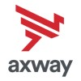
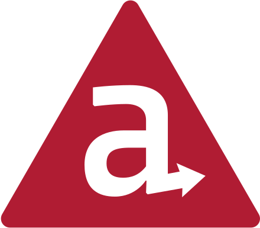

# Christopher Williams
🏠 Rochester, New York, United States

📫 chris.a.williams@gmail.com

📄 https://linkedin.com/in/christopher-williams-513a7a2

## Experience

###  Axway
#### Principal Software Architect II
##### March 2021 - Present

- Significant performance improvements in Eclipse-based IDE for API Gateway
  - OSGI-specific classloader fixes
  - Improved algorithms for topological sorting and cycle detection of policy graph(s)
- Architectural changes/improvments for handoff of Titanium to open source community
  - Hosting assets via Github release, updating CLI
  - Replacing https://docs.appcelerator.com with new updated doc website at https://titaniumsdk.com
  - Extending build/CI to use Github runners

#### Principal Software Engineer II
##### Jan 2016 - March 2021 (5 years +)

Worked across multiple teams and projects to push forward architectural changes and new functionality.
- Worked across iOS, Android, and Windows SDK platforms for Appcelerator Titanium - both in JavaScript and each platform's native language (Obj-C, Java and C++, respectively).
- Wrote custom test framework and suite for automated testing of Titanium SDK APIs and native modules across iPad/iPhone simulators and devices; macOS Catalyst apps; Android emulators and devices; Windows Phone emulator and Universal Windows apps.
- Automated build/release of SDK, native modules, and dozens of npm packages
- Automated and updated doc generation and conversion process from Confluence to legacy JSDuck website and new Vue/Markdown replacement
- Generated custom tooling to lint API docs to help enforce API consistency; additional scripts to generate automated API tests from API docs; rewrote legacy build process from Python scripts to Node.js based JavaScript.
- Instituted and maintained a ~25 node Jenkins-based CI/CD infrastructure, maintaining child nodes with custom chef cookbooks. Evolved CI nodes to use newer/varying versions of Xcode/Visual Studio/Android SDK/NDK. Automated setup/configuration of build nodes from scratch OS versus special manually maintained single build box.
- Drove usage and enforcment of code quality, formatting, linting and developmental tools using clang-format, danger.js, eslint, husky, lint-staged, commitizen, etc.

###  Appcelerator
#### Engineering Tech Lead
##### Sep 2012 - Jan 2016 (3 years 5 months)

- Tech lead for the Studio IDEs: Appcelerator, Titanium and Aptana.
- Initial implementation of Hyperloop for Android - exposing native (Java) Android & 3rd party APIs to Titanium SDK's JS environment.
- One of the engineers responsible for adding Windows Phone and Desktop SDK support to Appcelerator Titanium's supported platforms.
- Worked cross-product on Studio, Android SDK, iOS SDK, and Windows SDKs.

#### Senior Software Engineer
##### Jan 2011 - Aug 2012 (1 year 8 months)

Senior developer on Appcelerator, Titanium, and Aptana Studio products - IDEs built on top of Eclipse with varying branding and toolsets offered (for languages such as JS, Ruby, PHP, Python).

##  Aptana
#### Senior Software Engineer
##### May 2007 - Jan 2011 (3 years 9 months)

- Solo developer on Aptana RadRails - a Rails-focused IDE built on top of Eclipse and Aptana Studio, which added Ruby language support and tooling.
- Rewrite of Aptana Studio for v3 adding custom git support
- Initial POC of backend service for on-demand cloud hosting

###  Paychex
#### Senior Web Technologist R&D
##### Apr 2006 - Jun 2007 (1 year 3 months)

- Assisted in M&A discussions, research on software solutions for IT.
- Developed prototype internal web applications using Ruby on Rails.

###  Xerox
#### Software Engineer
##### Jun 2003 - Mar 2006 (2 years 10 months)

- Part of a team that developed an integrated network client that monitored printer usage, meters, hardware readings and could remotely report data for proactive maintenance, re-ordering and repairs.
- Assisted in efforts to establish a common set of data points and models for comparing reported data from multiple (differing) clients across different printer product lines - to aid in cross-product reliability metrics and re-use common code and queries for analyzing the data.

## Education
###  Rochester Institute of Technology
Bachelor of Science (B.S.), Computer Science 1999 - 2003

## Skills
 - JavaScript / Java / Ruby; Obj-C / C++ / Groovy
 - Git
 - Eclipse
 - REST
 - Agile Methodologies
 - Software Development
 - Object Oriented Design
